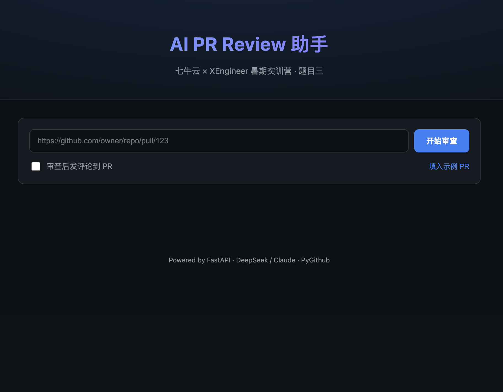
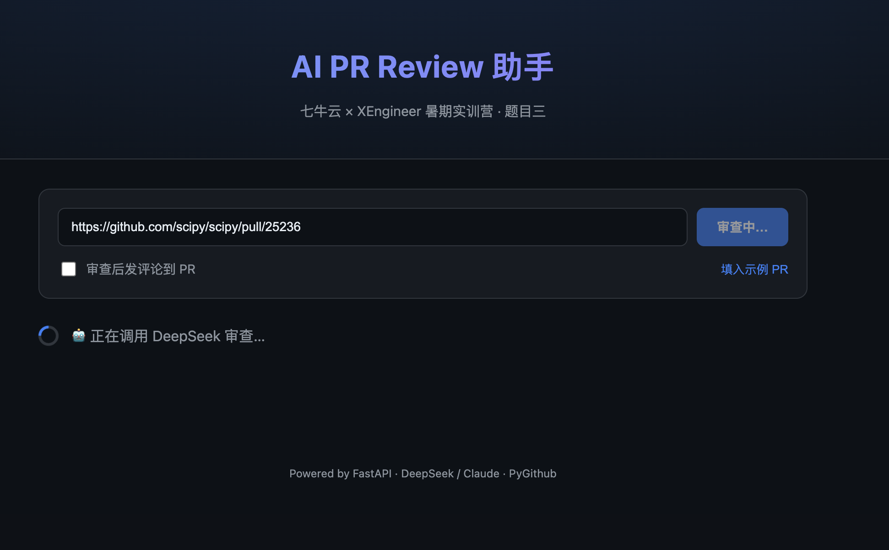
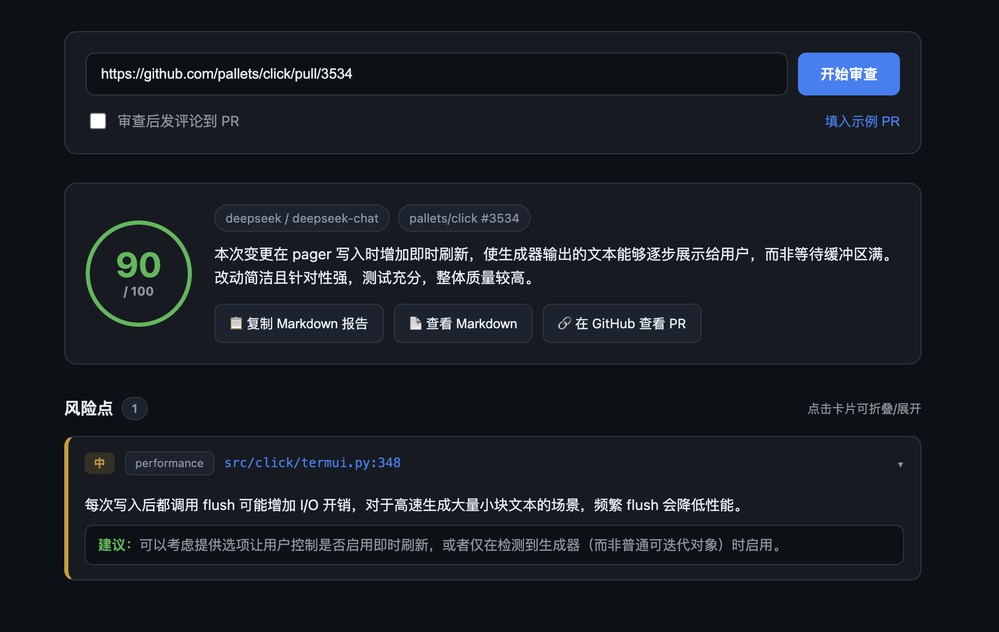
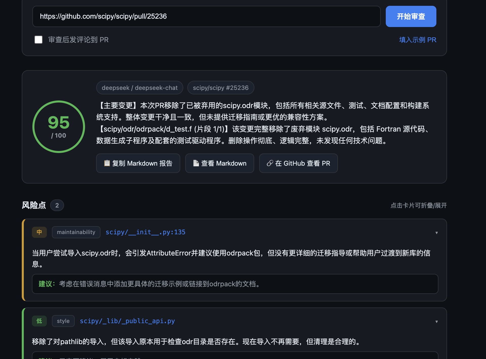
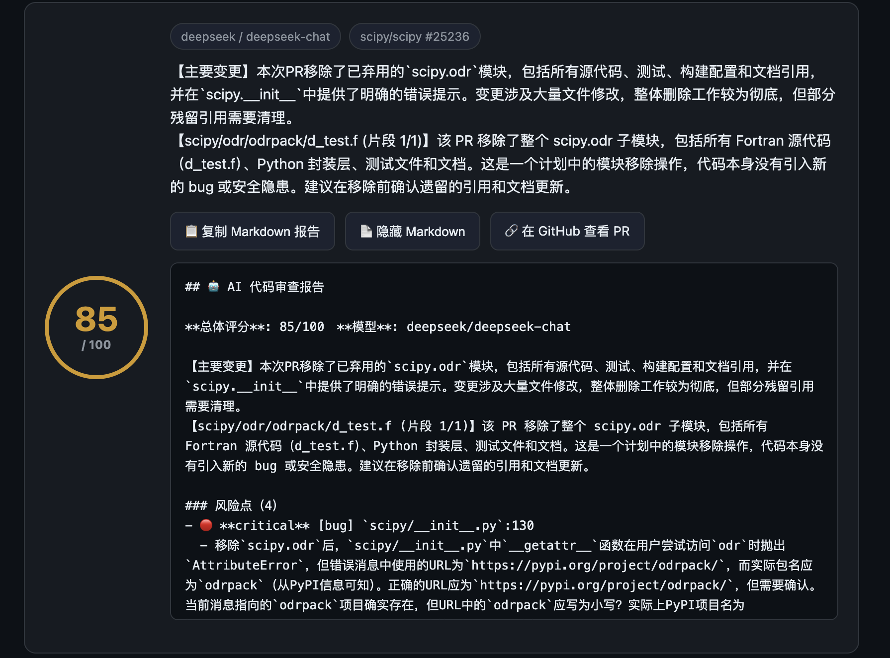

# qiniu-pr-review-assistant

AI-powered GitHub PR review assistant —— 七牛云 × XEngineer 暑期实训营 **题目三**

基于 **FastAPI + 多模型 LLM 抽象层** 的 GitHub Pull Request 自动审查助手：拉取指定 PR 的 diff，调用 LLM（默认 DeepSeek，可选 Claude）进行多维度代码审查，输出结构化、分级、可定位的风险点，并可一键回写为 PR 评论。

> 🌐 **在线 Demo**：http://117.50.181.92:8000/ （Docker 部署，直接粘贴 PR URL 即可体验）

## 🚀 快速开始

```bash
pip install -r requirements.txt      # 安装依赖
cp .env.example .env                 # 填入 DEEPSEEK_API_KEY 与 GITHUB_TOKEN
uvicorn app.main:app --reload        # 启动后浏览器打开 http://localhost:8000/
```



> 📄 完整设计文档（系统架构 / 模型选型 / 上下文分块 / 误报漏报控制 / 性能成本）见 **[docs/DESIGN.md](docs/DESIGN.md)**。

## 📸 界面截图

| 审查中 | 小 PR 结果 |
| :---: | :---: |
|  |  |

| 大 PR（hunk 分块）结果 | Markdown 导出 |
| :---: | :---: |
|  |  |

> 截图采集步骤（含演示用的 3 个真实 PR）见 [docs/screenshots/README.md](docs/screenshots/README.md)。

## 功能

- 拉取任意 GitHub 仓库指定 PR 的元信息与文件 diff（PyGithub）
- 调用 LLM 对 diff 做正确性 / 安全性 / 可维护性 / 性能 / 测试五维审查
- **多模型支持**：默认 DeepSeek-V3，一行配置切换 Claude，未来可扩展 GPT 等
- 可选地把审查报告作为评论发布回 PR

## 多模型支持

本项目通过 `app/llm_client.py` 的 **LLMClient 抽象层** 屏蔽底层厂商差异，上层审查逻辑只面向统一接口编程。

```
        app/reviewer.py  (审查逻辑，厂商无关)
                 │  get_llm_client()  ← 读取 .env 的 MODEL_PROVIDER
                 ▼
        ┌─────────────────────┐
        │  BaseLLMClient      │  统一接口: chat(messages) -> str
        └─────────────────────┘
           ▲              ▲                ▲
     ┌─────┴─────┐  ┌─────┴──────┐   ┌─────┴──────┐
     │DeepSeek   │  │ClaudeClient│   │（未来）GPT  │
     │Client     │  │            │   │ ...        │
     │openai SDK │  │anthropic   │   │            │
     │deepseek.  │  │SDK         │   │            │
     │com        │  │            │   │            │
     └───────────┘  └────────────┘   └────────────┘
       默认主力          可选             易扩展
```

| 厂商 | 默认模型 | SDK | 说明 |
| --- | --- | --- | --- |
| **DeepSeek**（默认） | `deepseek-chat` (V3) | openai | 成本约为 Claude 的 **1/50**，中文代码审查表现好 |
| Claude（可选） | `claude-sonnet-4-5` | anthropic | 质量更高，作为高要求场景的备选 |
| GPT 等（未来） | — | — | 实现一个 `BaseLLMClient` 子类即可接入 |

切换厂商只需改 `.env` 里的 `MODEL_PROVIDER`（`deepseek` / `claude`），无需改任何代码。

> 成本说明：DeepSeek 与 Claude 均支持上下文/prompt 缓存。`ClaudeClient` 会对稳定的审查规范前缀显式打 `cache_control` 断点；DeepSeek 为服务端自动上下文缓存。

## 技术栈

| 组件 | 用途 |
| --- | --- |
| FastAPI + Uvicorn | HTTP 服务 |
| openai SDK | 调用 DeepSeek（OpenAI 兼容协议） |
| anthropic SDK | 调用 Claude（可选） |
| PyGithub | 拉取 PR diff、发布评论 |
| Pydantic / pydantic-settings | 数据模型与配置 |

## 目录结构

```
app/
├── __init__.py
├── main.py           # FastAPI 入口与路由
├── github_client.py  # GitHub 拉取 diff / 发布评论
├── llm_client.py     # 多模型抽象层（DeepSeek / Claude / 工厂）
├── reviewer.py       # 审查逻辑（厂商无关，调用 get_llm_client）
└── models.py         # Pydantic 模型与配置
scripts/
├── test_fetch.py     # 验证 GitHub 拉取 diff
└── review.py         # 端到端验证：拉取 + LLM 审查
```

## 安装与配置（详细）

```bash
# 1. 安装依赖
python3 -m venv .venv && source .venv/bin/activate
pip install -r requirements.txt

# 2. 配置密钥
cp .env.example .env
# 编辑 .env：填入 DEEPSEEK_API_KEY 与 GITHUB_TOKEN（默认用 DeepSeek）

# 3. 启动服务
uvicorn app.main:app --reload
```

服务启动后访问 http://127.0.0.1:8000/docs 查看交互式 API 文档。

## 🐳 用 Docker 部署

项目已 Docker 化（多阶段构建、非 root 运行、`/health` 健康检查、镜像约 207MB）。

```bash
# 1. 准备密钥
cp .env.example .env          # 填入 DEEPSEEK_API_KEY 与 GITHUB_TOKEN

# 2. 一键构建并后台启动（仅 app）
docker compose up -d --build

# 3. 访问
#    http://<服务器IP>:8000
```

首次构建会拉取 `python:3.11-slim` 基础镜像并安装依赖（已配清华 pip 源），约 5–15 分钟。

### 可选：启用 nginx 反向代理

想用 80 端口（免带 `:8000`）访问时，启用 `with-nginx` profile：

```bash
docker compose --profile with-nginx up -d --build
# 访问 http://<服务器IP>/ （nginx 反代到 app:8000）
```

不加该 profile 时默认只起 app 服务，互不影响。反代配置见 [deploy/nginx.conf](deploy/nginx.conf)。

### 常用运维命令

```bash
docker compose ps                       # 状态 / 健康
docker compose logs -f --tail 100       # 实时日志
docker compose restart                  # 重启
git pull && docker compose up -d --build  # 更新代码并重建
docker compose down                     # 停止并移除容器
```

> 镜像通过 `.dockerignore` 排除了 `.env` / `.git` / `.venv` 等，密钥仅在运行时由 `env_file` 注入，不进镜像。

## API

### `POST /review`

```bash
curl -X POST http://127.0.0.1:8000/review \
  -H "Content-Type: application/json" \
  -d '{"repo": "octocat/Hello-World", "pr_number": 42, "post_comment": false}'
```

响应包含审查报告（Markdown）、使用的 `provider` 与 `model`。

### `GET /health`

健康检查。

## 命令行验证

```bash
# 仅验证 GitHub 拉取（需要 GITHUB_TOKEN）
python scripts/test_fetch.py https://github.com/owner/repo/pull/123

# 端到端：拉取 + LLM 审查（需要 GITHUB_TOKEN + 对应厂商的 API Key）
python scripts/review.py https://github.com/owner/repo/pull/123
```

## 环境变量

| 变量 | 必填 | 说明 |
| --- | --- | --- |
| `MODEL_PROVIDER` | ❌ | LLM 厂商，`deepseek`（默认）/ `claude` |
| `DEEPSEEK_API_KEY` | ⬩ | `MODEL_PROVIDER=deepseek` 时必填 |
| `ANTHROPIC_API_KEY` | ⬩ | `MODEL_PROVIDER=claude` 时必填 |
| `GITHUB_TOKEN` | ✅ | GitHub Personal Access Token（`repo` / `public_repo` 权限） |
| `DEEPSEEK_MODEL` | ❌ | 覆盖默认模型，默认 `deepseek-chat` |
| `ANTHROPIC_MODEL` | ❌ | 覆盖默认模型，默认 `claude-sonnet-4-5` |

## 致谢

- **七牛云 × XEngineer 暑期实训营** —— 提供题目三（AI PR Review 助手）与实践平台
- [DeepSeek](https://www.deepseek.com/) —— 高性价比的国产大模型，本项目默认审查引擎
- [Anthropic Claude](https://www.anthropic.com/) —— 可选的高精度审查模型
- [FastAPI](https://fastapi.tiangolo.com/) / [PyGithub](https://github.com/PyGithub/PyGithub) / [tenacity](https://github.com/jd/tenacity) 等优秀开源项目

## 许可证

本项目采用 [MIT License](LICENSE)。
