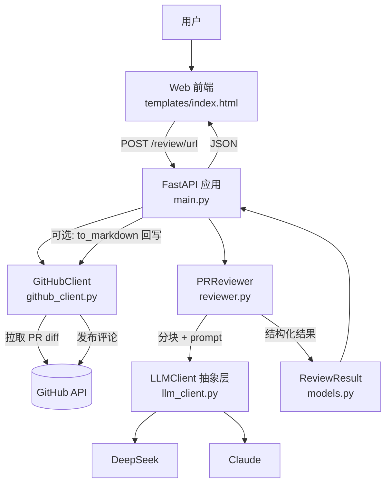

# AI PR Review 助手 — 设计文档

> 七牛云 × XEngineer 暑期实训营 · 题目三
> 本文档描述系统的设计动机、架构、关键技术决策与权衡。

## 1. 项目背景与目标

### 痛点
- **大型 PR review 耗时长**：一个数百行的 PR，人工逐行审查往往要 30 分钟以上，且注意力随行数下降。
- **容易漏看**：安全问题（硬编码密钥、注入）、边界条件、错误处理缺失等，在快速浏览时极易被略过。
- **初级工程师缺乏经验**：新人 review 时不知道"该看什么"，难以稳定覆盖正确性 / 安全 / 性能等多个维度。

### 目标
- 用 LLM 对 PR diff 做**第一遍自动筛查**，输出结构化、分级、可定位的风险点。
- 把"该关注哪些维度"沉淀进 prompt，**降低 reviewer 的心智负担**，让人聚焦在高价值判断上。
- 结果可一键回写为 PR 评论，融入现有协作流程。

### 非目标
- **不追求完全替代人工 review**。LLM 看不到完整调用关系与业务上下文，最终合并决策仍由人做出。
- 不做静态分析 / 编译期检查能覆盖的事（交给 linter、type checker、CI）。
- 本工具定位是"经验丰富的副驾驶"，不是"门禁"。

## 2. 系统架构

### 分层说明

| 层 | 模块 | 职责 |
| --- | --- | --- |
| **表现层** | `templates/index.html` | 单页前端：输入 PR URL、展示评分/风险卡片、复制报告、移动端适配 |
| **应用层** | `main.py` | FastAPI 路由、请求编排、大 PR 保护、请求级日志、监控指标、错误到 HTTP 状态码的映射 |
| **领域层** | `reviewer.py` / `models.py` | 审查核心逻辑（分块、prompt、解析合并）与领域模型（`Risk` / `ReviewResult`） |
| **基础设施层** | `github_client.py` / `llm_client.py` | 与外部系统交互：GitHub I/O、LLM 调用（含重试、token 统计） |

分层的核心收益是**依赖单向向下**：领域层只依赖抽象（`BaseLLMClient`），不关心具体是 DeepSeek 还是 Claude；更换 LLM 厂商或 Git 平台不影响审查逻辑。

## 3. 模型选择

### 对比

| 维度 | DeepSeek-V3（默认） | Claude Sonnet 4.5 | GPT-4 系列 | 通义千问 Qwen |
| --- | --- | --- | --- | --- |
| 代码理解 | 强 | 很强 | 很强 | 中~强 |
| 中文输出 | 很自然 | 自然 | 自然 | 很自然 |
| 成本 | 极低 | 高 | 高 | 低 |
| 延迟 | 低~中 | 中 | 中 | 低~中 |
| 强制 JSON | 原生 `response_format: json_object` | 靠 prompt（亦支持结构化输出） | 原生支持 | 支持 |
| 接入方式 | OpenAI 兼容协议 | anthropic SDK | openai SDK | OpenAI 兼容 |

> 上表为定性评估，用于选型权衡，非精确基准测试。

### 当前选型
- **默认 DeepSeek-V3**：代码审查是**输入密集**型任务（diff 长、输出短），DeepSeek 在中文输出与代码理解上够用，且单位成本远低于 Claude（详见 §6），适合高频、批量场景。
- **Claude 作为高精度备选**：对安全敏感、需要更强推理的关键 PR，可切到 Claude Sonnet（代码默认 `claude-sonnet-4-5`，可通过 `ANTHROPIC_MODEL` 覆盖为 `claude-sonnet-4-6` 等）。

### 切换机制
- 由环境变量 `MODEL_PROVIDER`（`deepseek` / `claude`）+ `LLMClient` 抽象层驱动，**切换厂商零代码改动**。
- 抽象接口极简：`chat(messages, **kwargs) -> str`。
- **未来加 GPT**：只需新增一个 `BaseLLMClient` 子类（包一层 openai SDK，base_url 指向 OpenAI），在 `get_llm_client()` 工厂里注册一个分支即可，领域层无感知。

## 4. 上下文获取与处理

### diff 获取
- 通过 **PyGithub** 拉取 `pull.get_files()`，得到每个变更文件的 `patch`（unified diff 文本）、`status`、增删行数。
- 同时取 PR 标题、描述、作者、base/head 分支作为审查上下文。
- PR URL 由正则解析为 `(owner/repo, pr_number)`，容忍 `/files`、`#discussion`、`?query` 等尾缀。

### 分块策略
LLM 有上下文窗口与成本约束，单次塞入超大文件既贵又可能超时。策略：

1. **普通文件合并审查**：所有未超阈值的文件拼进一次请求（"主要变更"块），节省往返与 token。
2. **单文件 > 2000 行（`MAX_FILE_LINES`）按 `@@` hunk 拆分**：unified diff 以 `@@ ... @@` 为 hunk 边界，按 hunk 切开，保证每块语义完整（不会从中间截断一段改动）。
3. **贪心合并 hunk**：把若干小 hunk 合并成一组，每组尽量不超过阈值，控制单次请求大小；单个超大 hunk 自成一组。

多块审查后，结果在领域层合并（风险点拼接去重排序、summary 按块标注、token 累加）。

### prompt 设计要点
- **角色明确**：系统提示词设定为"资深 code reviewer（senior code reviewer）"，锚定专业视角。
- **严格 JSON schema 输出**：要求只输出 `{summary, risks:[{file,line,severity,type,description,suggestion}], overall_score}`，不带任何多余文字 / 代码围栏——便于前端直接渲染，避免解析自然语言。
- **风险分级 4 档**：`critical / high / medium / low`，附明确分级标准（如 critical = 崩溃/数据损坏/安全漏洞，必须修复）。
- **问题类型 5 类**：`bug / security / performance / style / maintainability`，引导模型覆盖多个维度而非只挑一类。
- **显式约束降低幻觉**：明确"只报告有把握的问题""不要臆造行号，无法定位时 line 用 null"，抑制模型编造不存在的行号或风险。

## 5. 误报漏报控制

> review 工具的可用性取决于信噪比：误报多会让人失去信任，漏报多则失去价值。两端都要控。

### 误报控制（降低假阳性）
- **prompt 层**：显式要求"只报告你有把握的问题；没有问题时 risks 返回空数组"，并要求标注严重程度，引导模型自我过滤。
- **schema 校验层**：每个风险点经 Pydantic `Risk` 模型校验——`severity` / `type` 非法值回退到安全默认；`line` 容错（`"52-56"` → `52`，非法 → `null`）；解析失败的整条结果降级而非抛错。格式错误的"风险"被自然过滤掉。
- **展示层**：`severity=low` 的建议在前端**默认折叠**，减少视觉噪声，让人先看高优先级。

### 漏报控制（降低假阴性）
- **分块审查保证覆盖**：大文件按 hunk 拆分，**每一块都会被单独送入模型**，避免超长 diff 被截断导致后半段从未被"看到"。
- **最差分块主导总分**：多块时 `overall_score = min(各块得分)`，避免"一块严重问题被其他干净块稀释"成一个虚高的平均分。
- **类型维度强制覆盖**：输出 `type` 五分类（bug/security/performance/style/maintainability）促使模型系统性地从多个角度检查，而非只盯一处。

## 6. 性能与成本

### 实测数据（3 个真实开源 PR，DeepSeek-V3）

跨小 / 中 / 大三种体量各取一个真实 PR 实测：

| PR | 规模 | 分块 | 耗时 | 输入 token | 输出 token | 评分 | 风险 | 成本* |
| --- | --- | --- | --- | ---: | ---: | ---: | --- | ---: |
| [pallets/click#3534](https://github.com/pallets/click/pull/3534)（小） | 45 行 / 3 文件 | 1 块 | 3.0s | 1,375 | 195 | 90 | 1 high | ≈¥0.002 |
| [pytest-dev/pytest#14520](https://github.com/pytest-dev/pytest/pull/14520)（中） | 1,157 行 / 11 文件 | 1 块 | 2.6s | 12,359 | 65 | 95 | 0 | ≈¥0.012 |
| [scipy/scipy#25236](https://github.com/scipy/scipy/pull/25236)（大） | 18,794 行 / 51 文件 | **2 块**（单文件 2,199 行触发 hunk 分块） | 10.4s | 103,297 | 554 | 90 | 3（1 中 / 2 低） | ≈¥0.10 |

\* 成本按 DeepSeek ≈ ¥1 / ¥2 每百万 token（输入 / 输出）估算；单价随官方调整与缓存命中而变化，仅为量级参考。

几点观察：
- **token 与 diff 体积近似线性**：小→中→大约 1.4K → 12K → 103K 输入 token。
- **分块按预期触发**：大 PR 中 `scipy/odr/odrpack/d_test.f`（2,199 行 > 2,000 阈值）被单独切成一块，与其余 50 个文件的「主要变更」块分别审查后合并。
- **耗时可控**：即使 103K 输入、两块串行，也仅 ~10s（远低于前端 120s 超时）。

### 成本对比（以上面"大" PR 的 ~103K 输入 / 554 输出 为例）

| 模型 | 假设单价（输入 / 输出，每百万 token） | 该 PR 单次成本 |
| --- | --- | --- |
| DeepSeek-V3 | ≈ ¥1 / ¥2 | **≈ ¥0.10** |
| Claude Sonnet | ≈ ¥21 / ¥108（$3 / $15，按 ¥7.2/$ 折算） | **≈ ¥2.3** |

> 同一输入下 **DeepSeek 单次成本约为 Claude 的 1/20**（代码审查是输入密集型，比值由输入单价主导；输出单价差距更大可达 ~50×）——这是默认选 DeepSeek 的核心理由。

### Prompt caching
- **Claude 客户端已启用 ephemeral cache**：稳定的审查规范（system 前缀）打 `cache_control` 断点，跨多次审查复用，命中后该段约按 0.1× 计费。
- **DeepSeek**：服务端自动上下文缓存，相同前缀自动命中，无需显式参数。
- 关键约束：system 前缀保持字节稳定（不插入时间戳 / 随机 ID），否则缓存前缀失效。

### 延迟优化方向（待实现）
- **分块并行**：当前多块为串行审查，可改为并发请求后合并，大 PR 延迟可显著下降。
- **流式输出**：前端边生成边展示 summary，改善"长时间无反馈"的体感。

## 7. 安全考虑

- **API Key 隔离**：`ANTHROPIC_API_KEY` / `DEEPSEEK_API_KEY` / `GITHUB_TOKEN` 一律通过 `.env` 注入，`.gitignore` 已排除 `.env`，仓库只含 `.env.example` 模板，杜绝密钥入库。
- **GitHub Token 最小权限**：仅需 `repo`（私有）或 `public_repo`（公开）scope 即可拉 diff / 发评论，不申请多余权限。
- **大 PR 限流**：`> 80 文件` 或 `> 20000 行变更` 直接拒绝（HTTP 422），防止单请求 token 滥用与超时；其中行数是主要保护（更能反映 token 体量），文件数为辅。配合重试退避避免对上游放大压力。
- **不在前端暴露密钥**：`GET /config` 只返回当前 `provider` 名称，绝不返回任何 key。

## 8. 未来扩展方向

- **CI 集成**：GitHub Actions / Webhook，PR 一提交即自动 review 并评论，真正融入开发流。
- **IDE 插件**：VS Code 扩展，编辑器内直接查看 review，无需切到网页。
- **多语言支持**：当前 prompt 输出中文，可加 `LANG` 配置切换英文 / 双语，适配国际化团队。
- **增量审查**：记录上次 review 的 commit，仅审查其后的新增 commit，省 token 且聚焦。
- **团队规范注入**：读取仓库根的 `.review-rules.md` 作为额外 prompt，让审查贴合团队约定（命名、分层、禁用 API 等）。
- **模型微调**：基于团队历史 PR + 人工 review 标注微调小模型，进一步降本并贴合团队口味。
- **多模型投票**：Claude + DeepSeek 同时审查取交集 / 并集，交集降误报、并集降漏报，按场景选择。

## 9. 已知局限

- **跨文件依赖分析弱**：LLM 只看到 diff，看不到完整调用关系与类型信息，难以发现"改了 A 的签名但漏改 B 的调用"这类跨文件问题。
- **不支持二进制文件与超大 PR**：二进制无 patch 文本会被跳过；`> 20000 行` 的 PR 直接拒绝，需人工拆分。
- **中文输出对英文项目可能不够地道**：默认中文报告，若项目语境为英文，术语翻译可能略显生硬（可由未来的 `LANG` 配置缓解）。
- **依赖模型稳定性**：输出质量随模型版本与当下负载波动；结构化 schema 与校验能兜底格式，但无法保证每次都挑出全部问题——故定位为"辅助"而非"门禁"。
